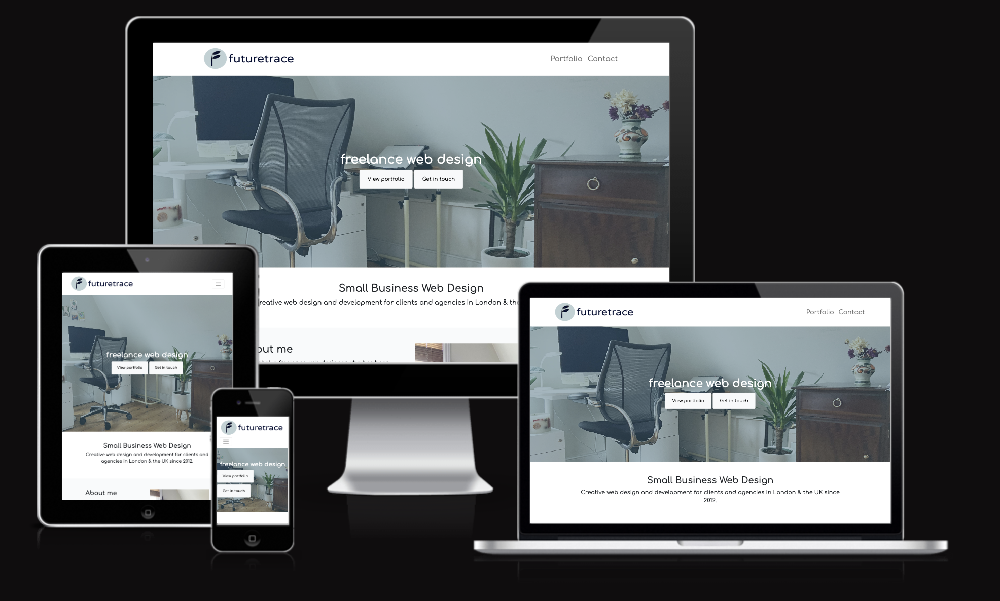
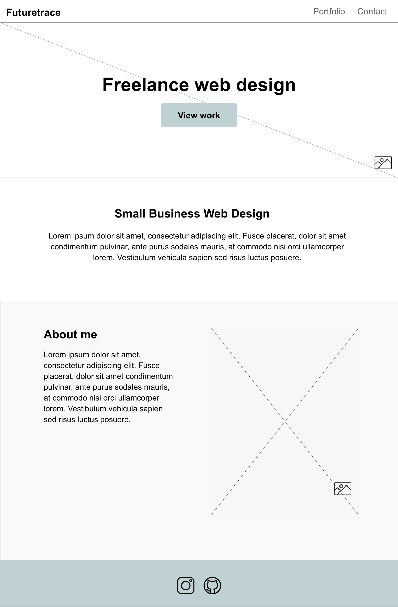
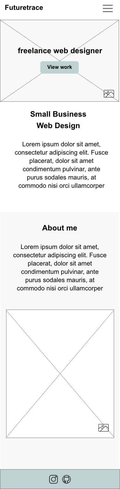
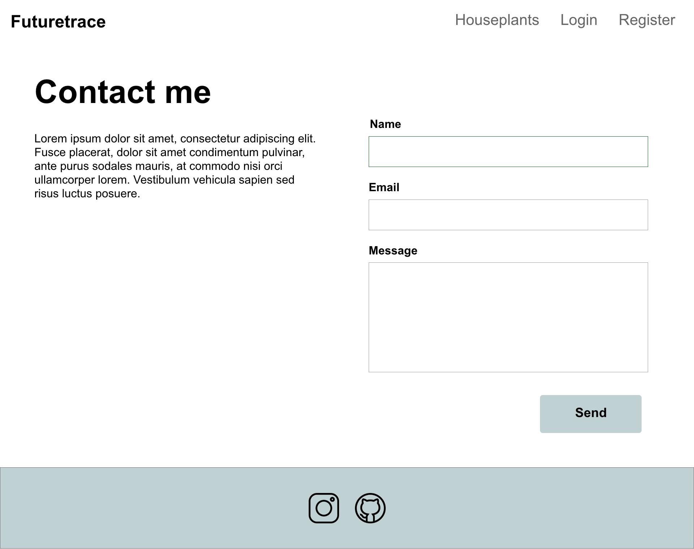
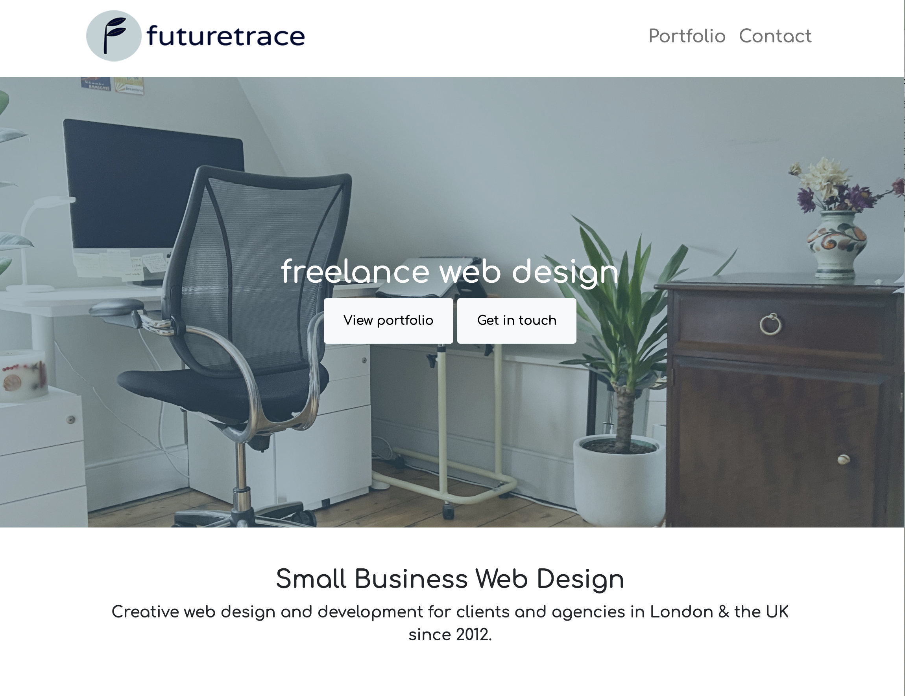
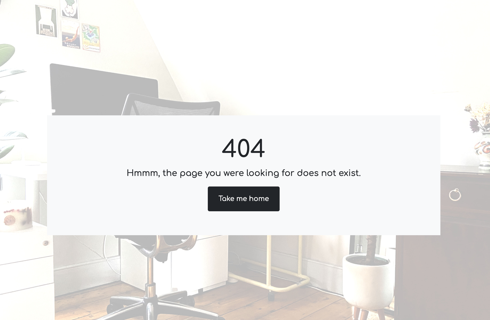
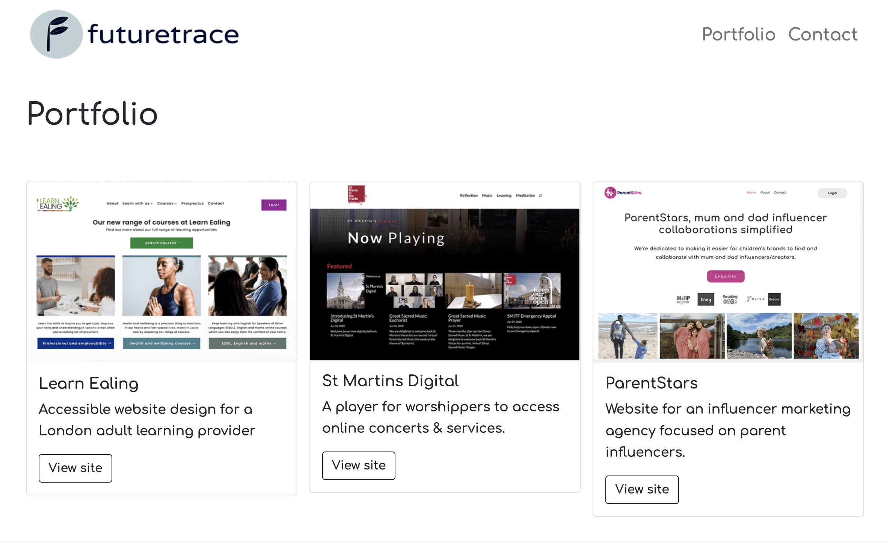

<h1 align="center">Freelance Web Designer website</h1>

[View the live project here.](https://rachelfurlong-dev.github.io/freelance-web-design-M1/index.html)

This is an experimental and promotional site for the freelance web design company Futuretrace. It is designed to be responsive and accessible on a range of devices, making it easy to navigate for potential clients.

<h2 text-align="center"></h2>

## User Experience (UX)

-   ### User stories

    -   #### First Time Visitor Goals

        1. As a First Time Visitor, I want to easily understand the main purpose of the site and learn more about the company.
        2. As a First Time Visitor, I want to be able to easily navigate throughout the site to find information about the company and what they do.
        3. As a First Time Visitor, I want to look for testimonials to understand what previous clients think of the company and see if they are trusted. 

    -   #### Returning Visitor Goals

        1. As a Returning Visitor, I want to be able to contact the company about prices and to get a quote for a potential project.
        2. As a Returning Visitor, I want to find see examples of previous work.
        3. As a Returning Visitor, I want to locate their social media links to see their followings on social media to determine how trusted and known they are.
        

    -   #### Frequent User Goals
        1. As a Frequent User, I want to check to see if there are any new examples of completed recent work.
        2. As a Frequent User, I want to be emailed any major updates and/or changes to the website or organisation. I want to know my data is being retained safely.

-   ### Design
    -   #### Colour Scheme
        -   The two main colours used are #C0D1D4, and #000000.
    -   #### Typography
        -   The Comfortaa font is the main font used throughout the whole website with Sans Serif as the fallback font in case for any reason the font isn't being imported into the site correctly. Comfortaa is a modern font from Google Fonts which is both attractive and relevant.
    -   #### Imagery
        -   Imagery is important. The large, background hero image is designed to describe the purpose of the business to the site visitor. It has a mcontemporary design aesthetic.

*   ### Wireframes
    -   #### Home Page Wireframe



-   #### Mobile Wireframe



-   #### Tablet Wireframe



## Features

-   Responsive on all device sizes

-   Interactive elements

## Technologies Used

### Languages Used

-   [HTML5](https://en.wikipedia.org/wiki/HTML5)
-   [CSS3](https://en.wikipedia.org/wiki/Cascading_Style_Sheets)

### Frameworks, Libraries & Programs Used

1. [Bootstrap 5:](https://getbootstrap.com/docs/4.4/getting-started/introduction/)
    - Bootstrap was used to assist with the responsiveness and styling of the website.
1. [Hover.css:](https://ianlunn.github.io/Hover/)
    - Hover.css was used on the Social Media icons in the footer to add the float transition while being hovered over.
1. [Google Fonts:](https://fonts.google.com/)
    - Google fonts were used to import the 'Titillium Web' font into the style.css file which is used on all pages throughout the project.
1. [Font Awesome:](https://fontawesome.com/)
    - Font Awesome was used on all pages throughout the website to add icons for aesthetic and UX purposes.
1. [jQuery:](https://jquery.com/)
    - jQuery came with Bootstrap to make the navbar responsive but was also used for the smooth scroll function in JavaScript.
1. [Git](https://git-scm.com/)
    - Git was used for version control by utilizing the Gitpod terminal to commit to Git and Push to GitHub.
1. [GitHub:](https://github.com/)
    - GitHub is used to store the projects code after being pushed from Git.
1. [Photoshop:](https://www.adobe.com/ie/products/photoshop.html)
    - Photoshop was used to create the logo, resizing images and editing photos for the website.
1. [Adobe XD:](https://adobe.com/)
    - Adobe XD was used to create the [wireframes](https://github.com/) during the design process.

## Testing

The W3C Markup Validator and W3C CSS Validator Services were used to validate every page of the project to ensure there were no syntax errors in the project.

-   [W3C Markup Validator](https://jigsaw.w3.org/css-validator/#validate_by_input) - [Results](docs/testing/homepage-html-error-check.png)
-   [W3C CSS Validator](https://jigsaw.w3.org/css-validator/#validate_by_input) - [Results](docs/testing/custom-css-error-check.png)

The Google Page-speed Services were used to assess the accessibiity of the project to ensure the site met expected accessible standareds on desktop and mobile.

-   [Google Pagespeed Insights mobile](https://pagespeed.web.dev/) - [Results](docs/testing/page-insights-mobile-accessibility-test.png)
-   [Google Pagespeed Insights desktop](https://pagespeed.web.dev/) - [Results](docs/testing/page-insights-desktop-accessibility-test.png)

### Testing User Stories from User Experience (UX) Section

-   #### First Time Visitor Goals

1. As a First Time Visitor, I want to easily understand the main purpose of the site and learn more about the organisation.

    1. Upon entering the site, users are automatically greeted with a clean and easily readable navigation bar to go to the page of their choice. Underneath there is a Hero Image with Text and two  Call to action buttons "View portfolio" & "Get in touch".
    2. The main points are made immediately with the main statement and the hero image.
    3. The user has two options, click the call to action buttons or scroll down, to learn more about the company.



2. As a First Time Visitor, I want to be able to easily be able to navigate throughout the site to find content.

    1. The site has been designed to be fluid and never to entrap the user. At the top of each page there is a clean navigation bar, each link describes what the page they will end up at clearly.
    2. On the Contact Us Page, after a form response is submitted, the page redirects to a confirmation page with the text "Thank you" and a sentence to say they wil be returning to the home page in 10 seconds. A 404 page allows the user who is lost due to typing incorrect url to return to the home page via a button.


3.  As a First Time Visitor, I want to look for testimonials to understand what previous clients think of the company and see if they are trusted.
        
    1. Once the new visitor has checked out the examples of previous work, they will notice the Feedback from clients section.
    2. The user can also scroll to the bottom of any page on the site to locate social media links in the footer.
    3. At the bottom of the Contact Us page, the user is told underneath the form, that alternatively they can contact the organisation on social media which highlights the links to them.

-   #### Returning Visitor Goals

    1. As a Returning Visitor, I want to be able to contact the company about prices and to get a quote for a potential project.

        1. I can contact the company via a form on the contact page.

    2. As a Returning Visitor, I want to find see examples of previous work.

        1. The portfolio page shows examples of previous work withg a description underneath.
        2. The user can click through to view the work in a new tab at the relevant website url.



3. As a Returning Visitor, I want to locate the company's social media links to see their followings on social media to determine how trusted and known they are.
    1. The Linkedin Page can be found at the footer of every page and will open a new tab for the user and more information can be found on the Facebook page.
    2. Alternatively, the user can view current activity on GitHub.

        

-   #### Frequent User Goals

    1. As a Frequent User, I want to check to see if there are any new examples of completed recent work.

        1. The portfolio page layout has been designed to allow additional work to be added and easily viewed by the user.

    2. As a Frequent User, I want to be emailed any major updates and/or changes to the website or organisation. I want to know my data is being retained safely.

        1. Users can click the link on the contact page following inputting their data to the form and view the privacy policy.

    3. As a Frequent User, I want to sign up to the Newsletter so that I am emailed any major updates and/or changes to the website or organisation.
        1. Underneath the form fields is a check box for users to check if they would like to receive the newsletter.
        2. Users can download the most recent newsletter from the link on the left hand side of the contact page.

### Further Testing

-   The Website was tested on Google Chrome, Internet Explorer, Microsoft Edge and Safari browsers.
-   The website was viewed on a variety of devices such as Desktop, Laptop, iPhone7, iPhone 8 & iPhoneX.
-   A large amount of testing was done to ensure that all pages were linking correctly.
-   Friends and family members were asked to review the site and documentation to point out any bugs and/or user experience issues.

### Known Bugs

-   On some mobile devices the Hero Image pushes the size of screen out more than any of the other content on the page.
    -   A white gap can be seen to the right of the footer and navigation bar as a result.
-   On Microsoft Edge and Internet Explorer Browsers, all links in Navbar are pushed upwards when hovering over them.

## Deployment

### GitHub Pages

The project was deployed to GitHub Pages using the following steps...

1. Log in to GitHub and locate the [GitHub Repository](https://github.com/)
2. At the top of the Repository (not top of page), locate the "Settings" Button on the menu.
    - Alternatively Click [Here](https://raw.githubusercontent.com/) for a GIF demonstrating the process starting from Step 2.
3. Scroll down the Settings page until you locate the "GitHub Pages" Section.
4. Under "Source", click the dropdown called "None" and select "Master Branch".
5. The page will automatically refresh.
6. Scroll back down through the page to locate the now published site [link](https://github.com) in the "GitHub Pages" section.

### Forking the GitHub Repository

By forking the GitHub Repository we make a copy of the original repository on our GitHub account to view and/or make changes without affecting the original repository by using the following steps...

1. Log in to GitHub and locate the [GitHub Repository](https://github.com/)
2. At the top of the Repository (not top of page) just above the "Settings" Button on the menu, locate the "Fork" Button.
3. You should now have a copy of the original repository in your GitHub account.

### Making a Local Clone

1. Log in to GitHub and locate the [GitHub Repository](https://github.com/)
2. Under the repository name, click "Clone or download".
3. To clone the repository using HTTPS, under "Clone with HTTPS", copy the link.
4. Open Git Bash
5. Change the current working directory to the location where you want the cloned directory to be made.
6. Type `git clone`, and then paste the URL you copied in Step 3.

```
$ git clone https://github.com/YOUR-USERNAME/YOUR-REPOSITORY
```

7. Press Enter. Your local clone will be created.

```
$ git clone https://github.com/YOUR-USERNAME/YOUR-REPOSITORY
> Cloning into `CI-Clone`...
> remote: Counting objects: 10, done.
> remote: Compressing objects: 100% (8/8), done.
> remove: Total 10 (delta 1), reused 10 (delta 1)
> Unpacking objects: 100% (10/10), done.
```

Click [Here](https://help.github.com/en/github/creating-cloning-and-archiving-repositories/cloning-a-repository#cloning-a-repository-to-github-desktop) to retrieve pictures for some of the buttons and more detailed explanations of the above process.

## Credits

### Code

-   The full-screen hero image code came from this [StackOverflow post](https://stackoverflow.com)

-   [Bootstrap4](https://getbootstrap.com/docs/4.4/getting-started/introduction/): Bootstrap Library used throughout the project mainly to make site responsive using the Bootstrap Grid System.

-   [MDN Web Docs](https://developer.mozilla.org/) : For Pattern Validation code. Code was modified to better fit my needs and to match an Irish phone number layout to ensure correct validation. Tutorial Found [Here](https://developer.mozilla.org/en-US/docs/Web/HTML/Element/input/tel#Pattern_validation)

### Content

-   All content was written by the developer.

-   Psychological properties of colours text in the README.md was found [here](http://www.colour-affects.co.uk/psychological-properties-of-colours)

### Media

-   All Images were created by the developer.

### Acknowledgements

-   My Mentor for continuous helpful feedback.

-   Tutor support at Code Institute for their support.